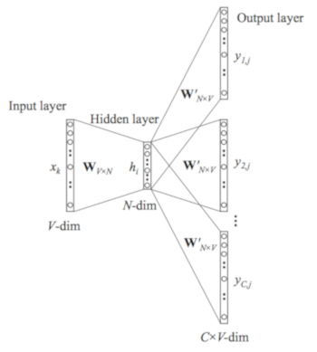
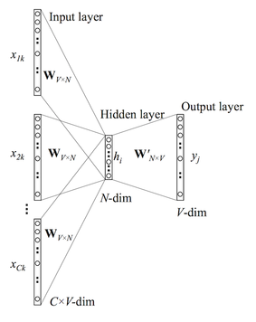
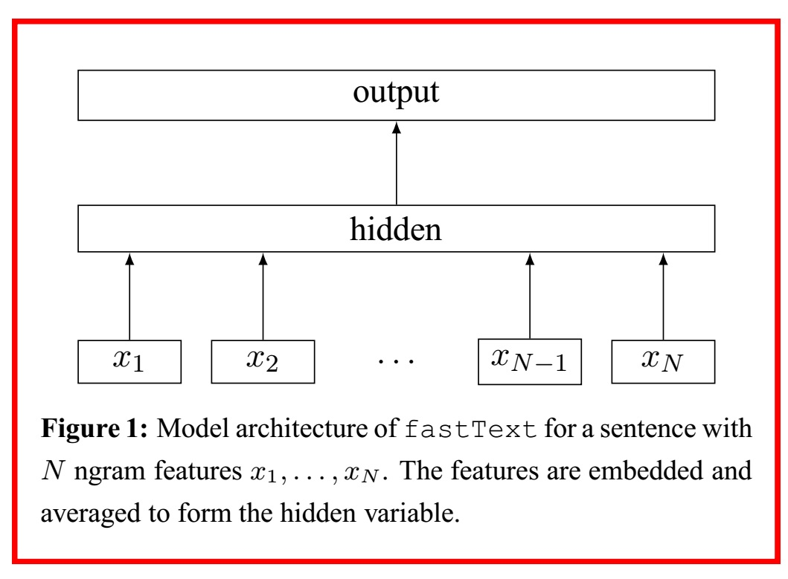

# Sentiment Analysis Using Word2Vec, FastText and Universal Sentence Encoder in [Keras](https://keras.io)

Opinion mining (sometimes known as sentiment analysis or emotion AI) refers to the use of natural language processing, text analysis, computational linguistics, and biometrics to systematically identify, extract, quantify, and study affective states and subjective information. Sentiment analysis is widely applied to voice of the customer materials such as reviews and survey responses, online and social media, and healthcare materials for applications that range from marketing to customer service to clinical medicine.[Source: [Wikipedia](https://en/wikipedia/wiki/Sentiment_analysis)]

This Repository shows sentimen analysis on **Twitter Data** using various word-embeddings model namely: Word2Vec, FastText, Universal Sentence Encoder.

Requirements: TensorFlow Hub, TensorFlow, Keras, Gensim, NLTK, NumPy, tqdm

The analysis is performed on **400,000 Tweets** on a **CNN-LSTM** DeepNet.

Architecture of model as generated by TensorBoard:

  

## [Word2Vec](https://github.com/danielfrg/word2vec)

Accuracy Achieved: **Approx 69%**

Python Notebook: [word2vec/word2vec-sentiment-analysis.ipynb](word2vec/word2vec-sentiment-analysis.ipynb)

Word2vec is a group of related models that are used to produce word embeddings. These models are shallow, two-layer neural networks that are trained to reconstruct linguistic contexts of words. Word2vec takes as its input a large corpus of text and produces a vector space, typically of several hundred dimensions, with each unique word in the corpus being assigned a corresponding vector in the space. Word vectors are positioned in the vector space such that words that share common contexts in the corpus are located in close proximity to one another in the space. [[Source: Wikipedia](https://en.wikipedia.org/wiki/Word2Vec)]

Docs in Gensim: [models.word2vec](https://radimrehurek.com/gensim/models/word2vec.html)

Word2Vec has 2 important models inside: Skip-Grams and Continous Bag-of-Words(CBOW)

### Skip-Grams:
In Skip-Gram model, we take a centre word and a window of context words  or neighbors within the context window and we try to predict context words for each centre word. The model generates a probability distribution i.e., probability of a word appearing in context given centre word and the task here is to choose the vector representation to maximize the probability.

  

  

### Continous Bag-of-Words (CBOW):
CBOW is opposite of Skip-Grams. We attempt to predict the centre word from the given context i.e., we try to predict the centre word by summing vectors of surrounding words.

  

## [FastText](https://github.com/facebookresearch/fastText)

Accuracy Achieved: **Approx 69%**

Python Notebook: [fastText/sentiment_analysis_fastext.ipynb](fastText/sentiment_analysis_fastext.ipynb)

fastText is a library for learning of word embeddings and text classification created by Facebook's AI Research (FAIR) lab. The model is an unsupervised learning algorithm for obtaining vector representations for words. Facebook makes available pretrained models for 294 languages. fastText uses Neural network for word embedding
 [[Source: Wikipedia](https://en.wikipedia.org/wiki/FastText)]

Docs on Gensim: [models.fasttext](https://radimrehurek.com/gensim/models/fasttext.html)

FastText is an extension to Word2Vec proposed by Facebook in 2016. Instead of feeding individual words into the Neural Network, FastText breaks words into several n-grams (sub-words). For instance, the tri-grams for the word apple is app, ppl, and ple (ignoring the starting and ending of boundaries of words). The word embedding vector for apple will be the sum of all these n-grams. After training the Neural Network, we will have word embeddings for all the n-grams given the training dataset. Rare words can now be properly represented since it is highly likely that some of their n-grams also appears in other words. I will show you how to use FastText with Gensim in the following section.

  

## [Universal Sentence Encoder](https://www.tensorflow.org/hub/modules/google/universal-sentence-encoder/1)

Accuracy Achieved: **Approx 77%**

Python Notebook: [universal-sentence-encoder/universal_sentence_encoder_sentiment-analysis.ipynb](universal-sentence-encoder/universal-sentence-encoder-sentiment-analysis.ipynb)

Released in 2018, The Universal Sentence Encoder encodes text into high dimensional vectors that can be used for text classification, semantic similarity, clustering and other natural language tasks.

The model is trained and optimized for greater-than-word length text, such as sentences, phrases or short paragraphs. It is trained on a variety of data sources and a variety of tasks with the aim of dynamically accommodating a wide variety of natural language understanding tasks. The input is variable length English text and the output is a 512 dimensional vector. We apply this model to the STS benchmark for semantic similarity, and the results can be seen in the example notebook made available. The universal-sentence-encoder model is trained with a deep averaging network (DAN) encoder.

Source: [TensorFlow/Hub/Universal-Sentence-Encoder](https://www.tensorflow.org/hub/modules/google/universal-sentence-encoder/2)

Further Readings:

- [Universal Sentence Encoder](https://arxiv.org/pdf/1803.11175.pdf)
- [The Current Best of Universal Word Embeddings and Sentence Embeddings](https://medium.com/huggingface/universal-word-sentence-embeddings-ce48ddc8fc3a)
- [Vector Representations of Words](https://www.tensorflow.org/tutorials/representation/word2vec)
- [Advances in Semantic Textual Similarity](https://ai.googleblog.com/2018/05/advances-in-semantic-textual-similarity.html)
- [fastText](https://research.fb.com/fasttext/)
- [Word2Vec and FastText Word Embedding with Gensim](https://towardsdatascience.com/word-embedding-with-word2vec-and-fasttext-a209c1d3e12c)
