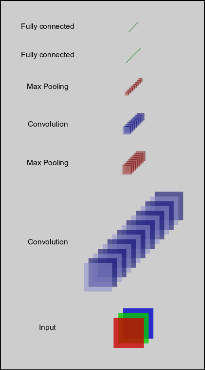
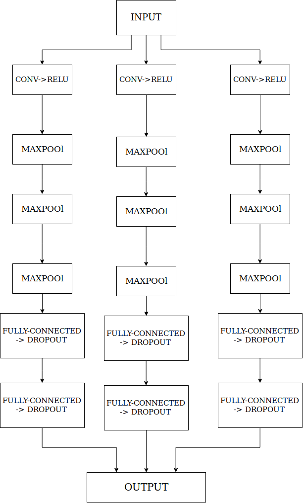

# Digit Recognition Using Deep Learning

MNIST ("Modified National Institute of Standards and Technology") is the facto "Hello World" dataset of computer vision.

The goal here is to identify digits from the given dataset.

MNIST Dataset can be found in 'train.csv' file with 785 Columns. Column 1 is the correct Label and Column 2 to 785 contains each pixel value of 28x28 image of handwritten digits.

I have implemented 5 models.
  - Feed Forward Neural Network (VANILLA)
  - Simple Recurrent Neural Network (RNN/LSTM)
  - Bidirectional Recurrent Neural Network (BRNN)
  - Multi Column Deep Neural Network (CNN)
  - Vote Multi Column Deep Neural Network (CNN)

## Usage:
Download the Complete Project
	```
	git clone https://github.com/jatinmandav/Neural-Networks
	```

Navigate to Neural-Network Directory
	```
	cd Neural-Network
	```

Train the Network you Desire from the above mentioned 5 Network models:

	usage: main.py [-h] [--save_model SAVE_MODEL] [--epochs EPOCHS]
               [--batch_size BATCH_SIZE] [--learning_rate LEARNING_RATE]
               [--feed_forward_architecture FEED_FORWARD_ARCHITECTURE]
               DATASET_PATH MODEL

	positional arguments:
	  DATASET_PATH          Path to Dataset File (.CSV)
	  MODEL                 Neural Network Model to Train
                          ['feed_forward', 'multi_column_cnn', 'simple_rnn',
                           'bidirectional_rnn', 'vote_multi_column_cnn']

	optional arguments:
	  -h, --help            show this help message and exit

	  --save_model SAVE_MODEL
                	        Where to save trained model?
                        	Default='model/model.ckpt'

	  --epochs EPOCHS       How many Epochs to train for? Default=10

	  --batch_size BATCH_SIZE
	                        What will be the batch Size? Default=128

	  --learning_rate LEARNING_RATE
	                        What will be the Learning rate? Default = 0.001

	  --feed_forward_architecture FEED_FORWARD_ARCHITECTURE
        	                If training Feed Forward Network, what will be the
	                        Architecture? Specify Number of neurons in each hidden
	                        layer EX: [500,500,500]
	

## Tests

I trained and tested the above 5 models for 200 Epochs, learning_rate 0.001, batch_size 128 and obtained the following results

  - Feed Forward Neural Network:
    - Command = `python3 main.py train.csv feed_forward --save_path feed_forward --epochs 200 --feed_forward_architecture [500,1000,500]`
    - Accuray ~ 97 %

  - Simple Recurrent Neural Network (RNN/LSTM):
    - Command = `python3 main.py train.csv simple_rnn --epochs 200 --save_model simple_rnn`
    - Accuray ~ 96 %

  - Bidirectional Recurrent Neural Network (BRNN):
    - Command = `python3 main.py train.csv bidirectional_rnn --epochs 200 --save_model bidirectional_rnn`
    - Accuray ~ 96 %

  - Multi Column Deep Neural Network (CNN):
    - Command = `python3 main.py train.csv multi_column_cnn --epochs 200 --save_model multi_column_cnn`
    - Accuray ~ 99 %

  - Vote Multi Column Deep Neural Network (CNN):
    - Command = `python3 main.py train.csv vote_multi_column_cnn --epochs 200 --save_model vote_multi_column_cnn`
    - Accuray ~ 99 %

Feel Free to play with the code, tweak parameters to improve the Network!

## Architecture

  - Multi Column Deep Neural Network

  <p align="center">  </p>

  - Vote Multi Column Deep Neural Network

  <p align="center">  </p>


#
